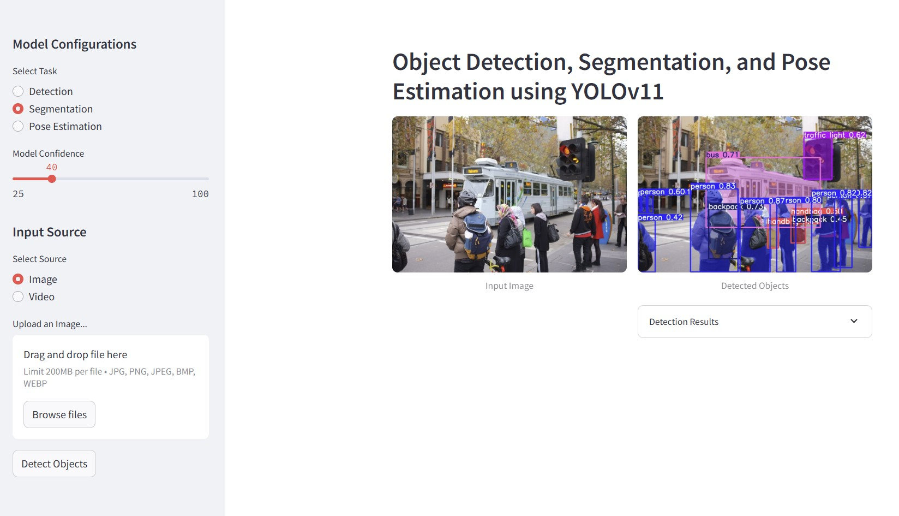
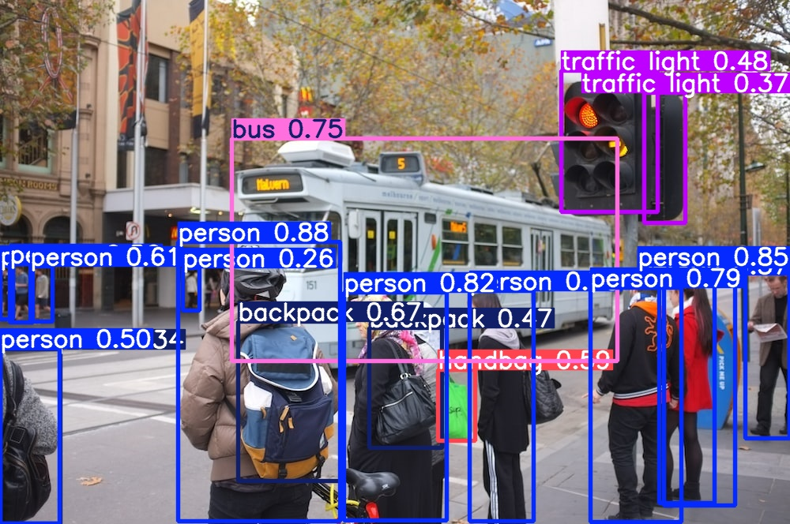

# YOLOv11 Streamlit App - Object Detection, Segmentation & Pose Estimation

This repository contains a **YOLOv11-powered Streamlit application** that processes **images and videos** for **Object Detection, Segmentation, and Pose Estimation**. The app is containerized using **Docker** and features **CI/CD deployment with GitHub Actions**.




---

## **Features**
- **Image & Video Processing**: Supports real-time object detection, segmentation, and pose estimation.
- **YOLOv11 Integration**: Uses pretrained **YOLOv11 models**.
- **Streamlit UI**: Interactive web app for easy usage.
- **Docker Support**: Containerized application for easy deployment.
- **CI/CD with GitHub Actions**: Automates build and deployment.

---

## **Installation & Running Locally**

### **1. Clone the Repository**
```bash
git clone https://github.com/your-username/E2E_ObjectDetection_Segmentation_PoseEstimation_CICD.git
cd E2E_ObjectDetection_Segmentation_PoseEstimation_CICD
```

### **2. Install Dependencies**
Create a virtual environment (optional but recommended):
```bash
python -m venv venv
source venv/bin/activate  # On macOS/Linux
venv\Scripts\activate     # On Windows
```

Install dependencies:
```bash
pip install -r requirements.txt
```

### **3. Run Streamlit App**
```bash
streamlit run app.py
```

Access the app at **http://localhost:8501**.

---

## **Docker Setup**

### **1. Build Docker Image**
```bash
docker build -t yolo11-streamlit .
```

### **2. Run Docker Container**
```bash
docker run -p 8501:8501 yolo11-streamlit
```

App will be available at **http://localhost:8501**.

---

## **GitHub Actions CI/CD Pipeline**
This project uses **GitHub Actions** for automated deployment.

### **Workflow Steps:**
1. **Builds and Tests** the application.
2. **Creates & Pushes Docker Image** to Docker Hub.
3. **Deploys to a Remote Server** (Optional).

### **Triggering the Workflow**
The workflow runs automatically on **push to the `main` branch**.

To manually trigger:
1. Go to **GitHub → Actions**.
2. Select **Deploy Streamlit App** workflow.
3. Click **Run Workflow**.

---

## **Project Structure**
```
.github/workflows/    # GitHub Actions CI/CD workflow
config/               # Configuration files
images/               # Sample images for testing
utils/                # Image & video processing utilities
videos/               # Sample video files
weights/              # YOLOv11 model weights
.gitignore            # Git ignore rules
app.py                # Streamlit application
Dockerfile            # Docker container definition
requirements.txt      # Python dependencies
```
